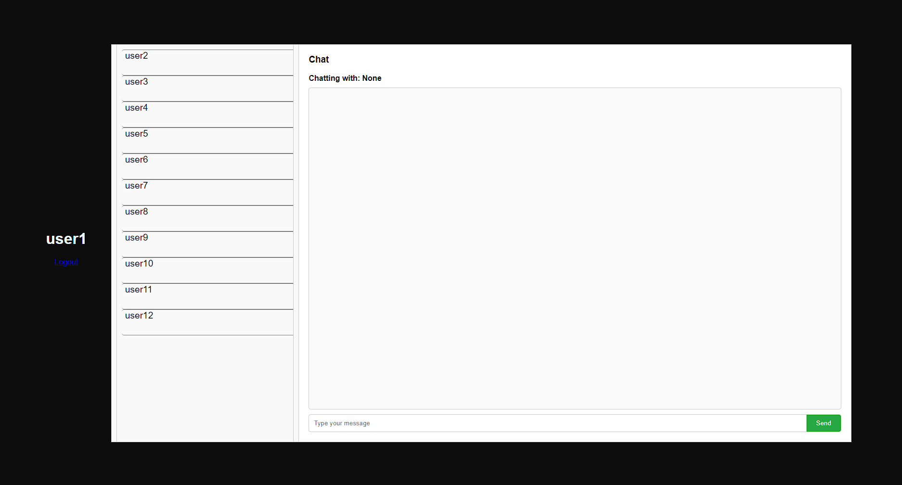

# Web Chat Application using Flask, Kafka, and PostgreSQL

This web chat application allows users to communicate in real-time using Kafka as the communication protocol. It is built using Flask for the backend, Kafka for real-time messaging, and PostgreSQL for message persistence.

## Features

- **User Authentication**: Users can register, login, and logout securely.
- **Real-time Messaging**: Messages are delivered in real-time using Kafka.
- **Message Persistence**: Messages are stored in PostgreSQL for later retrieval.
- **Chat History**: Users can view their chat history with other users.
- **Notification Badge**: Displays unread message count in the user list.
- **Responsive Design**: The frontend is designed to be responsive across devices.

## Setup Instructions

1. Clone the repository:
   ```bash
   git clone https://github.com/your-username/web-chat-app.git
   cd web-chat-app
   ```

2. Install dependencies:
   ```bash
   pip install -r requirements.txt
   ```

3. Set up the PostgreSQL database:
   - Create a PostgreSQL database named `chat_db`.
   - Update the database URI in the `DATABASE_URL` environment variable.

4. Start the Kafka server:
   - Download and install Kafka from [https://kafka.apache.org/downloads](https://kafka.apache.org/downloads).
   - Start the Zookeeper and Kafka servers.

5. Start the Flask application:
   ```bash
   init_db.py
   python app.py
   ```

6. Access the application in your browser at [http://localhost:5000](http://localhost:5000).

## Folder Structure

- `app.py`: Main Flask application file.
- `static/`: Contains static files like CSS and JavaScript.
- `templates/`: Contains HTML templates.
- `models.py`: Defines database models using SQLAlchemy.
- `init_db.py`: To create all the needed tables.
- `requirements.txt`: List of Python dependencies.

## Technologies Used

- Flask: Python web framework for the backend.
- Kafka: Distributed streaming platform for real-time messaging.
- PostgreSQL: Relational database for message storage.
- HTML/CSS/JavaScript: Frontend technologies for user interface.
- SQLAlchemy: Python SQL toolkit and ORM for database interactions.
- Kafka-Python: Python client for Kafka messaging.

## Screenshots



